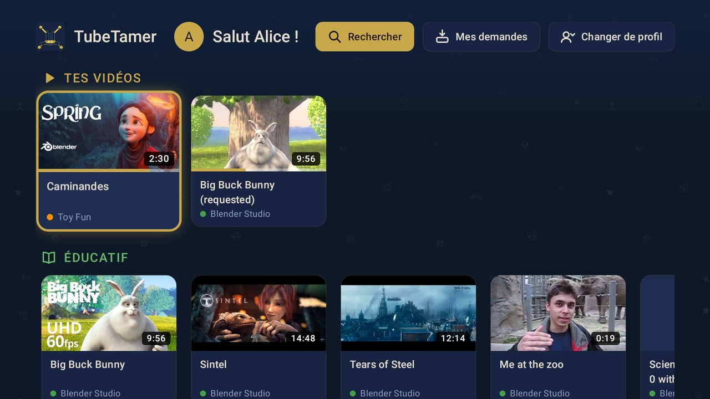
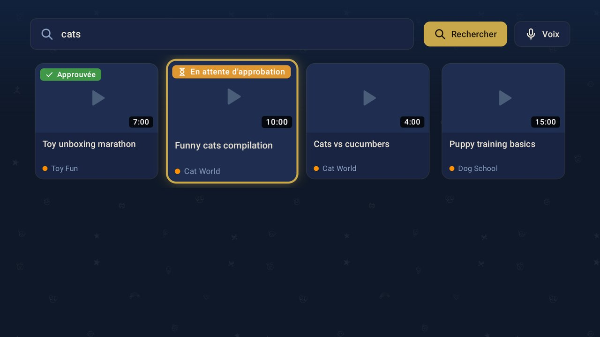

<p align="center">
  
</p>

<p align="center">
  <strong>Système d'approbation YouTube pour les enfants — avec un serveur qui télécharge la vidéo à votre place.</strong><br>
  Votre enfant cherche et demande des vidéos. Vous approuvez ou refusez depuis votre téléphone via Telegram.<br>
  Le serveur télécharge la vidéo en local. Pas de YouTube sur la tablette, pas d'algorithme, pas de vérification anti-bot sous Firefox.
</p>

<p align="center">
  <a href="README.md">English</a> · <strong>Français</strong>
</p>

---

## Sommaire
- [De quoi s'agit-il ?](#de-quoi-sagit-il-)
- [Pourquoi ce fork ?](#pourquoi-ce-fork-)
- [Fonctionnalités](#fonctionnalités)
- [Démarrage rapide](#démarrage-rapide)
- [Ce dont vous avez besoin](#ce-dont-vous-avez-besoin)
- [Documentation](#documentation)
- [Licence](#licence)

## De quoi s'agit-il ?

TubeTamer vous permet de contrôler ce que vos enfants regardent sur YouTube, sans rester derrière leur épaule.

Votre enfant dispose d'une page web simple sur sa tablette où il peut chercher des vidéos YouTube et les demander. Chaque demande vous envoie un message Telegram avec la miniature, le titre, la chaîne et la durée de la vidéo. Vous touchez **Approuver** ou **Refuser** directement dans la conversation. Si la vidéo est approuvée, elle se lance automatiquement sur la tablette.

**La différence avec les lecteurs YouTube intégrés classiques :** le serveur de TubeTamer télécharge d'abord la vidéo sur votre machine, puis la diffuse en local à l'appareil de l'enfant. YouTube ne touche jamais la tablette. Pas de vérification anti-bot, pas de message « Connectez-vous pour confirmer que vous n'êtes pas un robot », pas de compte Google nécessaire, et cela fonctionne avec tous les navigateurs, Firefox compris.

Pas de compte YouTube sur la tablette. Pas de publicités. Pas de spirale algorithmique. Pas de lecture automatique de la « vidéo suivante ».

### Fonctionnement

```
Votre réseau
┌─────────────────────────────────────────────────────────────────────┐
│                                                                     │
│  Blocage DNS (Pi-hole / AdGuard / routeur)                          │
│  youtube.com ──────────────────────────────────────────► BLOQUÉ ✗  │
│  googlevideo.com ──────────────────────────────────────► BLOQUÉ ✗  │
│                                                                     │
│  Tablette de l'enfant            Serveur TubeTamer                  │
│  ┌──────────────┐                ┌────────────────────┐             │
│  │ Navigateur   │                │ Autorisé dans le   │             │
│  │ youtube.com → BLOQUÉ          │ DNS                │             │
│  │              │  1. Demande    │ youtube.com ──────►│─── yt-dlp ──┼──► YouTube
│  │ TubeTamer ───┼───────────────►│  2. Prévient       │             │
│  │ (autorisé) ◄─┼─ 6. Lecture ──│◄─ le parent        │             │
│  └──────────────┘                │  5. Téléchargement │             │
│                                  │     terminé        │             │
│                                  └────────────────────┘             │
│                                          │                          │
└──────────────────────────────────────────┼──────────────────────────┘
                                           │ 3. Notification Telegram
                                           ▼
                                    Téléphone du parent
                                    [Approuver] [Refuser]
                                       4. ▼
                                    Le serveur télécharge
                                    la vidéo via yt-dlp
```

1. **YouTube est bloqué** sur l'appareil de l'enfant via le DNS (Pi-hole, AdGuard ou routeur) : `youtube.com` et `googlevideo.com` sont inaccessibles depuis la tablette.
2. L'enfant ouvre TubeTamer (autorisé) dans n'importe quel navigateur, cherche une vidéo et touche **Demander**.
3. Vous recevez une notification Telegram avec la miniature, le titre, la chaîne et la durée.
4. Vous touchez **Approuver** : le serveur (autorisé dans votre DNS, il peut donc joindre YouTube) met le téléchargement en file d'attente.
5. La vidéo est téléchargée en arrière-plan avec yt-dlp et ffmpeg, puis stockée localement sur votre serveur.
6. La tablette lit la vidéo depuis votre serveur : elle n'a jamais contacté YouTube.

L'enfant garde un **accès complet au navigateur** : seuls YouTube et Google Video sont bloqués, pas Internet. Pas besoin de Family Link ni de restrictions sur le navigateur.

> Le **mode lecteur intégré** reste disponible si vous ne souhaitez pas télécharger les vidéos. Il fonctionne comme dans le projet d'origine, mais YouTube doit alors être accessible depuis la tablette.


## Pourquoi ce fork ?

TubeTamer est un fork de [BrainRotGuard](https://github.com/GHJJ123/brainrotguard) de [@GHJJ123](https://github.com/GHJJ123), un excellent projet qui en est l'inspiration directe.

Le projet d'origine utilise les lecteurs YouTube intégrés. Cela fonctionnait très bien, jusqu'à ce que Google renforce sa détection des bots début 2025. La lecture anonyme intégrée s'est alors heurtée au message « Connectez-vous pour confirmer que vous n'êtes pas un robot », surtout sous Firefox et sur les appareils sans compte Google connecté. L'approche d'origine devenait peu fiable pour le cas d'usage visé : une tablette d'enfant verrouillée, sans compte Google.

La solution : **sortir complètement le problème YouTube de la tablette.** Au lieu d'intégrer YouTube sur l'appareil de l'enfant, le serveur TubeTamer télécharge la vidéo avec yt-dlp et la diffuse en local. La tablette ne contacte jamais YouTube : elle lit simplement un fichier vidéo depuis votre serveur maison. Pas de vérification anti-bot, pas de mur de connexion, compatible Firefox, compatible avec tous les navigateurs, sans compte Google.

Ce fork ajoute :
- **Téléchargement et diffusion locale des vidéos** comme mode de lecture principal
- **Compatibilité complète avec Firefox** : aucune restriction de navigateur
- **Aucun contact avec YouTube depuis la tablette** : isolation totale du suivi de Google

Toutes les fonctionnalités d'origine (profils multi-enfants, approbations Telegram, limites de temps, listes de chaînes, traductions) sont conservées.

## Fonctionnalités

### Pour les enfants
- **Fonctionne sur tous les appareils et navigateurs** : tablette Android, iPad, Firefox, Chrome, Kindle Fire, sans compte Google
- **Recherche simple** : on tape ce que l'on veut, on voit les résultats, on touche Demander
- **Lecture instantanée** : les vidéos approuvées sont diffusées depuis votre serveur, sans YouTube ni publicités
- **Aucun trafic Google sur la tablette** : les vidéos *et* les miniatures sont servies par votre serveur, l'appareil de l'enfant fonctionne même si toute la plage d'adresses IP de Google est bloquée
- **Bibliothèque de vidéos** : parcourir tout ce qui a déjà été approuvé
- **Navigation par catégorie** : filtrer le contenu éducatif ou divertissant en un geste
- **Navigation par chaîne** : voir les dernières vidéos des chaînes pré-approuvées sans demander chacune d'elles
- **YouTube Shorts** : une rangée dédiée aux Shorts avec miniatures verticales et lecteur 9:16
- **Aperçu des miniatures** : survol ou défilement pour faire défiler plusieurs miniatures avant de demander
- **Thème sombre** : reposant pour les yeux, pensé pour les tablettes
- **Application Android TV** : une application TubeTamer native pour la télé (testée sur NVIDIA Shield) : profil et PIN, rangées et chaînes, recherche et demandes, lecture plein écran depuis votre serveur avec les mêmes limites de temps. Distincte de l'application YouTube, installée sans ADB. Voir le [guide Android TV](docs/android-tv.md)

   


### Pour les parents
- **Approbation par Telegram** : approuver ou refuser de n'importe où, en un geste
- **Téléchargement local** : le serveur télécharge les vidéos approuvées avec yt-dlp, la tablette lit depuis votre serveur
- **Listes de chaînes autorisées ou bloquées** : faites confiance à une chaîne une fois, ses nouvelles vidéos sont approuvées automatiquement
- **Profils multi-enfants** : code PIN, historique de visionnage et temps autorisé distincts pour chaque enfant
- **Catégories Éduc/Fun** : étiquetez les chaînes et vidéos comme éducatives ou divertissantes, chacune avec sa limite quotidienne
- **Limites de temps quotidiennes** : limites distinctes pour l'éducatif et le divertissement, ou une limite globale unique
- **Horaires autorisés** : définissez quand regarder est permis (par ex. 8 h–19 h, pas pendant l'école)
- **Horaires par jour** : plages horaires et limites différentes pour chaque jour de la semaine
- **Assistant de configuration** : `/time setup` guide le choix du mode de limite et des horaires avec des boutons
- **Temps bonus** : accordez des minutes supplémentaires pour aujourd'hui seulement (`/time add 30`)
- **Contrôle des Shorts** : activez ou masquez les YouTube Shorts dans toute l'application
- **Journal d'activité** : voyez ce qui a été regardé, pendant combien de temps, groupé par catégorie
- **Interface et bot localisés** : anglais, français et norvégien, avec une bascule EN/FR dans l'en-tête qui change l'interface *et* les titres des vidéos pour ce navigateur seulement, et un affichage de l'heure en 12 h/24 h selon la langue ou forcé
- **Filtres de mots** : bloquez les vidéos dont le titre contient certains mots
- **Historique des recherches** : voyez tout ce que votre enfant a cherché
- **Chaînes de départ** : liste de chaînes adaptées aux enfants (éducatives et amusantes) à importer au premier démarrage
- **Notifications de mise à jour** : alerte Telegram automatique quand une nouvelle version est disponible sur GitHub
- **Verrouillage par PIN** : un code PIN optionnel pour que seul votre enfant accède à l'interface web depuis le bon appareil
- **Télés connectées** : `/devices` liste les télés connectées à l'application TV et révoque n'importe laquelle en un geste

### Confidentialité et sécurité
- **100 % auto-hébergé** : fonctionne entièrement sur votre propre matériel, dans votre réseau local. Pas de service cloud, pas de compte tiers, pas d'abonnement
- **Aucune clé d'API** : utilise [yt-dlp](https://github.com/yt-dlp/yt-dlp) pour la recherche, les métadonnées et le téléchargement
- **Pas de YouTube sur la tablette** : en mode lecture locale, l'appareil de l'enfant ne contacte jamais YouTube ni Google
- **Base de données en un seul fichier** : toutes les données sont dans un fichier SQLite sur votre machine. Rien ne part vers l'extérieur
- **Conteneur exécuté sans droits root** : bonne pratique de sécurité Docker

## Démarrage rapide

> **Prérequis :** [Docker](https://docs.docker.com/get-docker/), un [jeton de bot Telegram](https://core.telegram.org/bots#how-do-i-create-a-bot) et votre [identifiant de conversation](docs/setup.md#step-2-get-your-chat-id). Premier essai ? Le **[guide d'installation complet](docs/setup.md)** (en anglais) détaille chaque étape.

```bash
git clone https://github.com/SirTerrific/tubetamer.git
cd tubetamer
cp .env.example .env
cp config.example.yaml config.yaml
# Renseignez dans .env le jeton du bot et l'identifiant de conversation
docker compose up -d
```

Ouvrez `http://<adresse-ip-du-serveur>:8080` sur la tablette de l'enfant.

**Activer le téléchargement des vidéos** (recommandé : retire complètement YouTube de la tablette) :

Dans `config.yaml` :
```yaml
local_playback:
  enabled: true
  quality: 720p
```

**Image pré-construite** (sans étape de build, amd64 + arm64) :
```bash
docker pull ghcr.io/sirterrific/tubetamer:latest
```

Voir le [guide d'installation](docs/setup.md#using-the-pre-built-docker-image) pour le détail du fichier compose.

**Bloquer YouTube sur votre réseau** (recommandé : la lecture locale devient le seul moyen de regarder) :

Bloquez `youtube.com` et `googlevideo.com` dans votre résolveur DNS (Pi-hole, AdGuard Home ou routeur), et autorisez l'adresse IP de votre serveur TubeTamer pour qu'il puisse toujours télécharger les vidéos. Voir l'[étape 5](docs/setup.md#step-5-block-youtube-on-the-network).

## Ce dont vous avez besoin

| Élément | Description |
|---------|-------------|
| **Un ordinateur toujours allumé** | Raspberry Pi, vieux portable ou serveur maison : tout ce qui fait tourner Docker |
| **Docker** | [Installer Docker](https://docs.docker.com/get-docker/) |
| **Un compte Telegram** | L'application de messagerie où vous recevrez les demandes d'approbation |
| **Un jeton de bot Telegram** | Créé en 5 minutes avec [@BotFather](https://core.telegram.org/bots#how-do-i-create-a-bot) |
| **Un résolveur DNS** (recommandé) | [Pi-hole](https://pi-hole.net/), [AdGuard Home](https://adguard.com/adguard-home/overview.html) ou un routeur avec filtrage DNS pour bloquer `youtube.com` sur l'appareil de l'enfant |

> **Pourquoi Telegram ?** C'était le moyen le plus simple d'avoir des notifications instantanées avec des boutons approuver/refuser utilisables depuis le téléphone. Pas d'application à développer, pas d'infrastructure de notifications push à maintenir : Telegram s'en charge.

> **Note réseau :** TubeTamer tourne sur votre réseau local. L'appareil de l'enfant doit être sur le même réseau pour accéder à l'interface web et lire les vidéos. Vous pouvez approuver ou refuser de n'importe où via Telegram, sans être chez vous.

> **Note DNS :** quand vous bloquez `youtube.com` par DNS, assurez-vous que le serveur TubeTamer utilise un autre résolveur (par ex. `8.8.8.8` directement) ou qu'il est autorisé par son IP dans AdGuard/Pi-hole. Sinon le serveur ne pourra pas télécharger les vidéos non plus.

## Documentation

La documentation détaillée est rédigée en anglais.

- **[Guide d'installation](docs/setup.md)** : de la création du bot Telegram au verrouillage de l'appareil
- [Référence de configuration](docs/configuration.md) : options de config.yaml, variables d'environnement, valeurs par défaut
- [Application Android TV](docs/android-tv.md) : compilation, installation sur la télé sans ADB, premier démarrage, dépannage, captures d'écran
- [Guide des langues](i18n/locales/README.md) : fonctionnement des traductions et ajout d'une langue
- [Commandes Telegram](docs/telegram-commands.md) : liste complète des commandes du bot parent
- [Dépannage](docs/troubleshooting.md) : problèmes courants et solutions
- [Architecture](docs/architecture.md) : schémas du système et flux des requêtes
- [Choix de conception](docs/design-decisions.md) : pourquoi yt-dlp, Telegram, SQLite, etc.
- [Sans Docker](docs/running-without-docker.md) : installation Python simple (sans conteneur)

## Soutien

Si TubeTamer vous est utile :

[](https://buymeacoffee.com/menelikiii)

## Licence

[MIT](LICENSE) : utilisez-le comme vous voulez.
