# Application Android TV

[English](android-tv.md) · **Français**

L'application TV de TubeTamer permet à un enfant de regarder les vidéos
approuvées sur un boîtier Android TV (cible testée : NVIDIA Shield) avec son
propre profil et son PIN. C'est une application distincte, nommée **TubeTamer** :
elle ne remplace pas l'application YouTube et n'y touche pas.

La télé ne contacte jamais YouTube. Le serveur télécharge les vidéos approuvées
et les diffuse à la télé : le petit stockage de la télé ne se remplit jamais, et
les mêmes règles que sur l'application web s'appliquent : approbations, filtres
de mots, chaînes bloquées, limites de temps, horaires et réglage des Shorts.

## Ce qu'il faut côté serveur

- **Lecture locale activée** : `local_playback.enabled: true` dans `config.yaml`
  (ou `BRG_LOCAL_PLAYBACK=true`). Sans cela, la télé affiche
  « La lecture locale est désactivée sur le serveur ».
- **Un profil enfant** (`/child add <nom> [pin]` dans Telegram). La télé se
  connecte avec le profil et son PIN.
- **Le même réseau que la télé.** L'application parle en HTTP simple, comme
  l'application web ; toute personne sur le réseau pourrait lire le jeton d'une
  télé. Gardez TubeTamer sur le réseau domestique, ou placez-le derrière un
  reverse proxy HTTPS et utilisez l'adresse `https://` sur la télé.

## Compiler l'APK

Prérequis : Android Studio (pour son SDK et son JDK 21), sur le PC qui compile.

```bash
cd android-tv
# Windows (Git Bash) : utiliser le JDK d'Android Studio pour cette commande seulement
export JAVA_HOME="/c/Program Files/Android/Android Studio/jbr"
./gradlew assembleRelease
```

L'APK se trouve dans `android-tv/app/build/outputs/apk/release/app-release.apk`.

### Clé de signature de release (une seule fois)

Android n'installe que des APK signés, et n'accepte une mise à jour que si elle
est signée avec la **même clé** que l'application installée. Créez la clé une
fois, gardez-la précieusement, et ne la commitez jamais (`*.jks` et
`keystore.properties` sont dans `android-tv/.gitignore`).

1. Créez la clé. `keytool` demande les mots de passe ; choisissez-les vous-même :

   ```bash
   cd android-tv
   "$JAVA_HOME/bin/keytool" -genkeypair -v -keystore tubetamer-release.jks \
     -alias tubetamer -keyalg RSA -keysize 4096 -validity 10000
   ```

2. Créez `android-tv/keystore.properties` avec les mots de passe choisis :

   ```properties
   storeFile=tubetamer-release.jks
   storePassword=...
   keyAlias=tubetamer
   keyPassword=...
   ```

3. Sauvegardez `tubetamer-release.jks` et les mots de passe en lieu sûr
   (gestionnaire de mots de passe). Si vous les perdez, l'application TV devra
   être désinstallée avant de pouvoir installer un nouveau build.

Sans `keystore.properties`, `assembleRelease` produit un APK non signé
qu'Android refuse d'installer. Pour une simple vérification locale du build
minifié, `./gradlew assembleRelease -PdebugSignedRelease` le signe avec la clé
de debug ; n'installez pas ce build sur la télé de l'enfant : les mises à jour
signées avec la clé de release ne s'installeraient pas par-dessus.

## Installer sur la télé (sans ADB)

### Depuis le serveur TubeTamer (recommandé)

1. Placez l'APK sur le serveur. Avec Docker :

   ```bash
   docker cp android-tv/app/build/outputs/apk/release/app-release.apk tubetamer:/app/db/tubetamer.apk
   ```

   Le fichier est dans le volume `db`, il survit aux mises à jour du conteneur.
   Un autre emplacement peut être défini avec `web.tv_apk` (ou `BRG_TV_APK`).
2. Vérifiez depuis un navigateur : `http://<serveur>:8080/app/tubetamer.apk`
   télécharge le fichier. Cette URL ne demande pas de PIN : l'APK ne contient
   aucun secret.
3. Sur la télé, installez **Downloader** (par AFTVnews) depuis le Play Store.
4. Dans Downloader, saisissez `http://<serveur>:8080/app/tubetamer.apk`.
5. Quand Android le demande, autorisez **Installer des applis inconnues** pour
   Downloader, puis installez. Vous pouvez retirer cette autorisation ensuite.

### Clé USB

Copiez l'APK sur une clé USB, branchez-la sur la télé et ouvrez le fichier avec
une application de gestion de fichiers (par exemple *File Commander* ou
*X-plore*). Elle doit avoir l'autorisation **Installer des applis inconnues**.

### Send Files to TV

Installez **Send Files to TV** sur la télé et sur un téléphone ou un PC,
envoyez l'APK, puis ouvrez-le sur la télé.

### Mise à jour

Installez le nouvel APK de la même façon, par-dessus l'application existante.
L'enfant reste connecté. La mise à jour doit être signée avec la même clé de
release.

## Premier démarrage sur la télé

1. **Adresse du serveur** : saisissez l'adresse affichée dans le navigateur
   quand vous ouvrez TubeTamer, par exemple `192.168.1.10:8080` (`http://` est
   ajouté s'il manque).
2. **Qui regarde ?** : choisissez le profil de l'enfant, puis tapez le PIN avec
   la télécommande.
3. L'accueil affiche les vidéos de l'enfant, les rangées Éducatif et
   Divertissement, les Shorts s'ils sont activés, et les chaînes. **Recherche**
   et **Mes demandes** sont dans l'en-tête.

L'application utilise la langue du serveur (`app.locale`), pour que les menus
correspondent aux titres des vidéos. **Changer de profil** ramène au choix du
profil.

## Contrôles parentaux

- Les approbations arrivent dans Telegram comme celles de l'application web.
- `/devices` liste les télés connectées (appareil, enfant, dernière utilisation)
  avec un bouton **Révoquer** pour chacune. Une télé révoquée revient au choix
  du profil.
- Les limites de temps et les horaires sont comptés sur le serveur : quand le
  budget est épuisé pendant une vidéo, la télé s'arrête et indique quand les
  vidéos seront de nouveau disponibles.

## Dépannage

**« Pas de réponse du serveur »** : la télé n'atteint pas l'adresse. Vérifiez
que le serveur tourne, le port (8080 par défaut), et que la télé est sur le même
réseau. Essayez l'adresse dans un navigateur sur un autre appareil.

**« Cette adresse n'est pas un serveur TubeTamer » / « trop ancien »** :
l'adresse pointe vers un autre service, ou le serveur est antérieur à
l'application TV (v1.4.0 ou plus récent requis).

**« La lecture locale est désactivée sur le serveur »** : définissez
`local_playback.enabled: true` et redémarrez le serveur.

**« Préparation de la vidéo… » reste à 0 %** : le serveur la télécharge.
Vérifiez que le serveur peut joindre YouTube et cherchez des erreurs yt-dlp
dans `docker compose logs`.

**Retour au choix du profil sans rien avoir fait** : la connexion de la télé a
été révoquée avec `/devices` ou a expiré (un an après la connexion). Choisissez
le profil et tapez le PIN.

**« Application non installée »** lors d'une mise à jour : le nouvel APK est
signé avec une autre clé. Désinstallez TubeTamer de la télé, puis réinstallez.

## Tests automatisés

```bash
cd android-tv
./gradlew testDebugUnitTest            # client API, modèles, utilitaires (sans appareil)
./gradlew connectedDebugAndroidTest    # tests UI Compose, nécessite l'émulateur ou une télé en ADB
```

Le côté serveur de l'API TV est couvert par la suite Python (`pytest`) :
`tests/test_api_v1*.py`, `tests/test_bot_devices.py`, `tests/test_tv_apk.py`.

## Captures d'écran

Prises sur l'émulateur Android TV (1080p) avec des données de démonstration ;
l'interface suit la langue du serveur (le français ici).

| | |
|---|---|
| 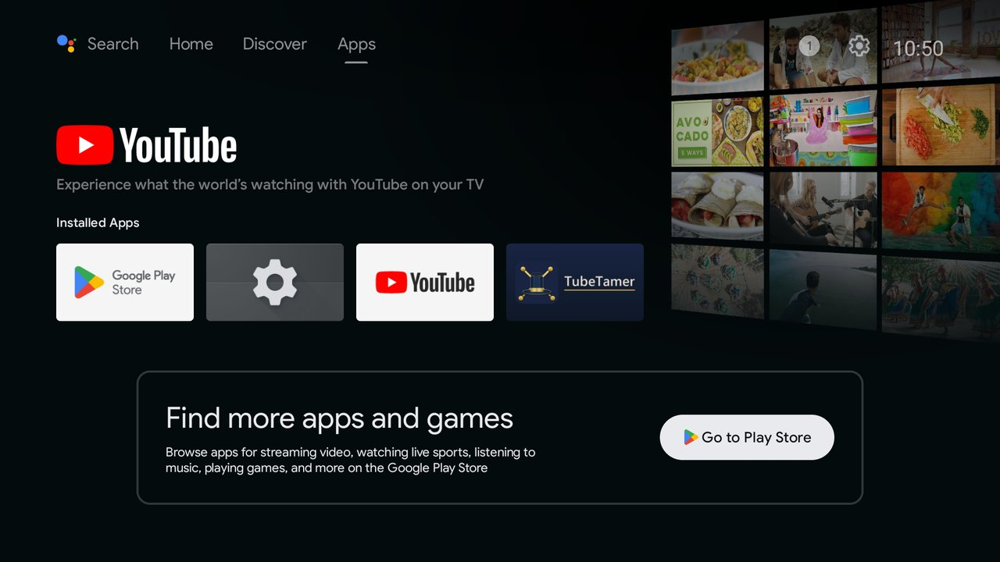 | 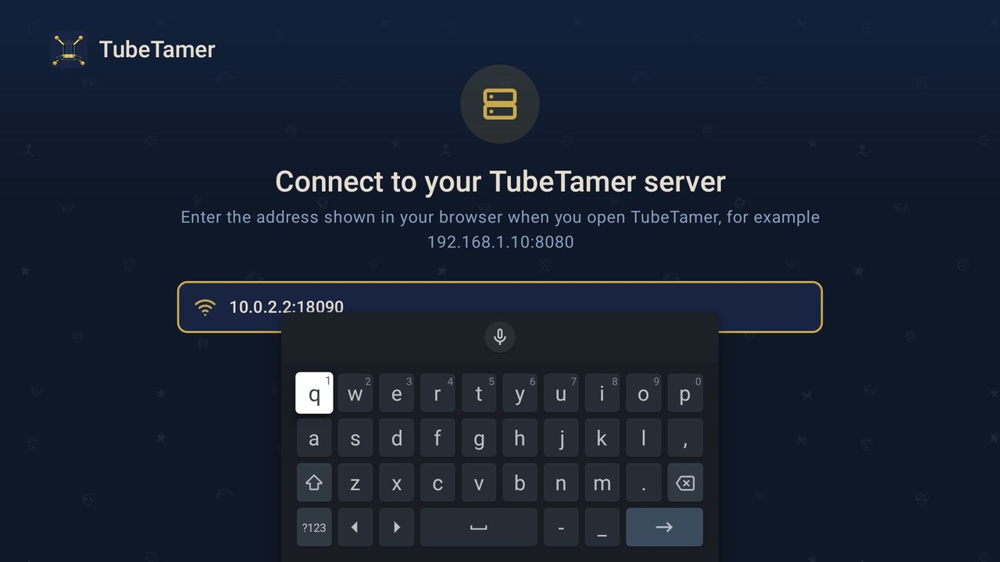 |
| Bannière du lanceur | Adresse du serveur, au-dessus du clavier de la télé |
| 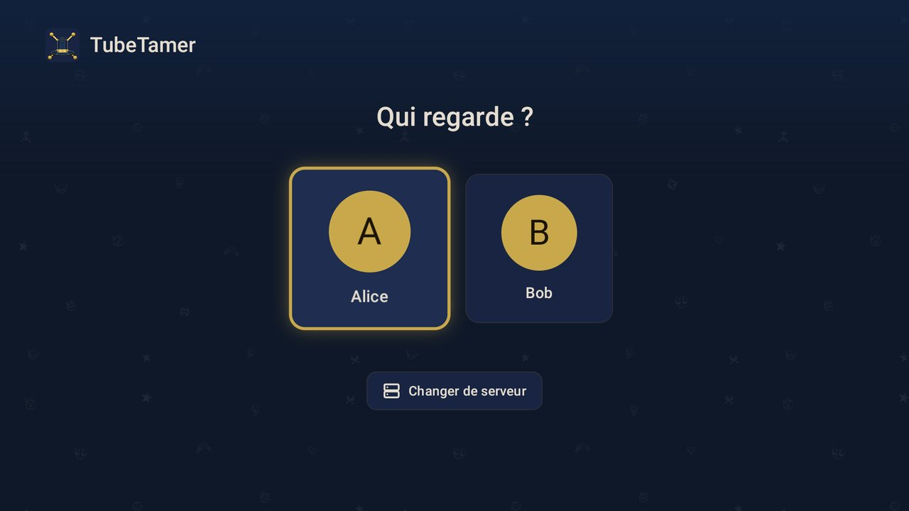 | 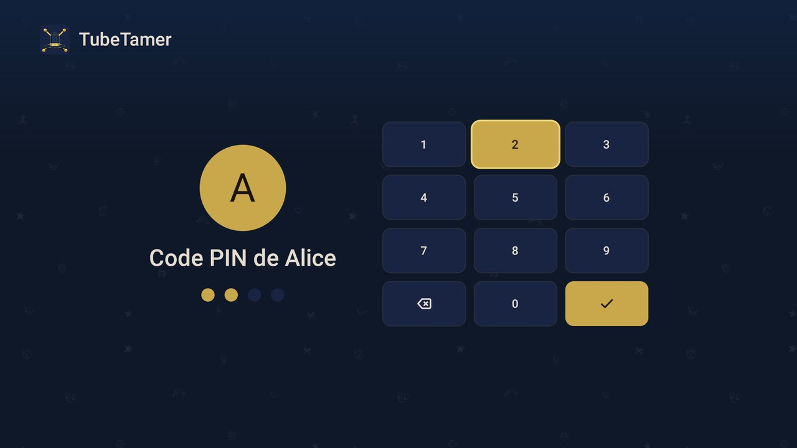 |
| Choix du profil | Pavé PIN pour la télécommande |
|  | 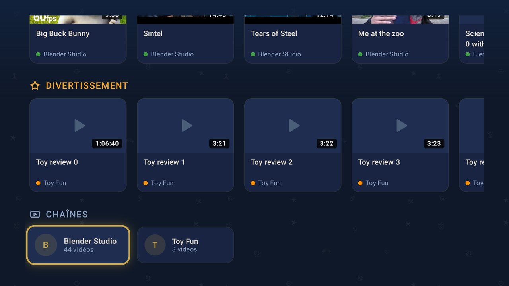 |
| Accueil : reprise, catégories | Rangée Divertissement et chaînes |
| 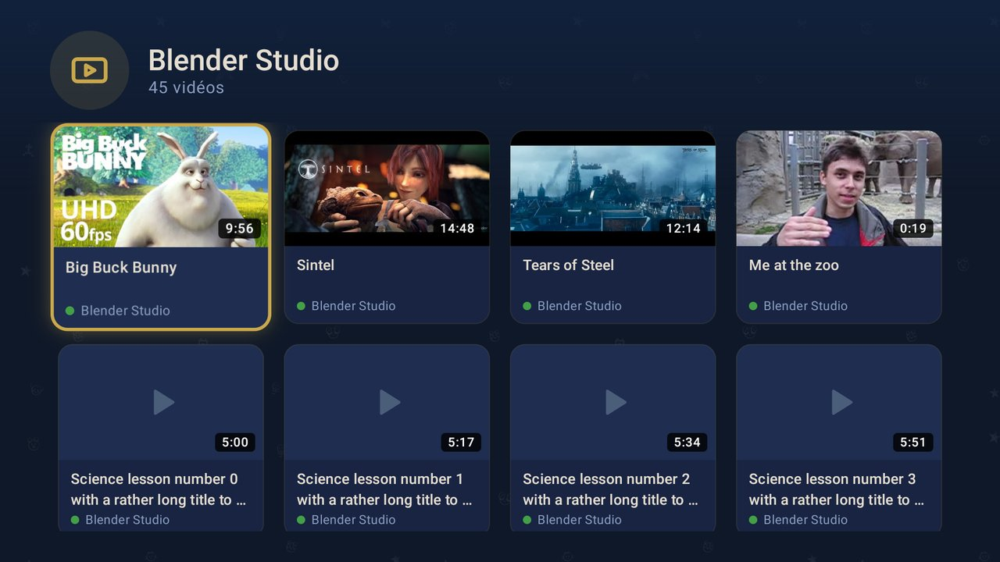 |  |
| Page d'une chaîne | Résultats de recherche avec statut des demandes |
| 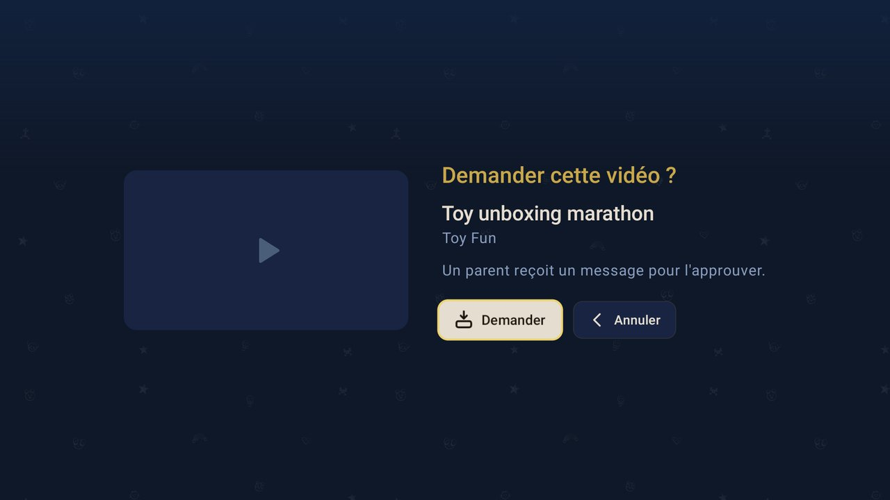 | 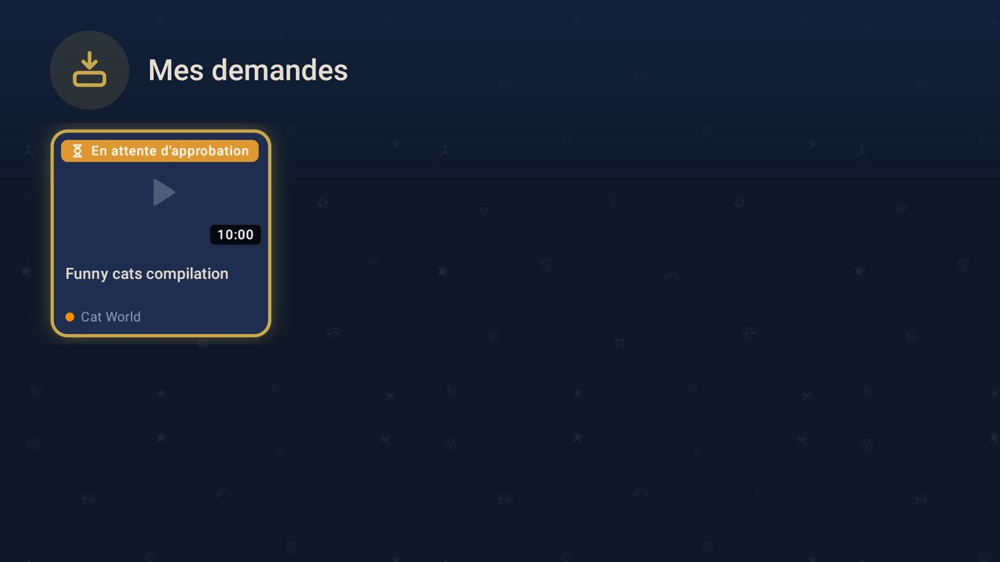 |
| Demander une vidéo | Mes demandes |
|  | 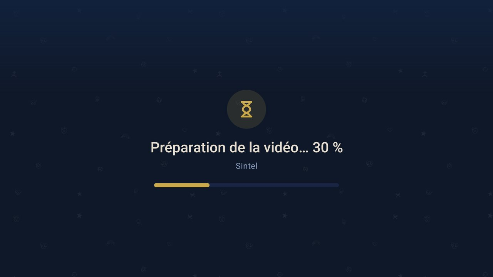 |
| Lecteur avec le badge de temps restant | Le serveur télécharge encore |
| 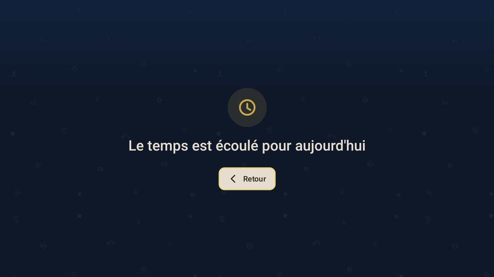 | 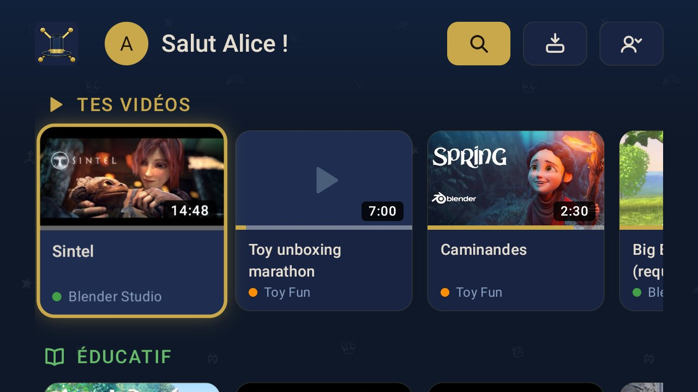 |
| Limite quotidienne atteinte | Petit écran : en-tête en icônes, moins de cartes |

La mise en page s'adapte à l'écran : la taille des cartes et le nombre de colonnes suivent la largeur (d'environ 2 cartes par rangée sur les petits écrans à 6 sur les grands, la carte suivante dépassant pour montrer que les rangées défilent), l'en-tête ne garde que des icônes sous 840 dp, et le pavé PIN rétrécit sur les écrans peu hauts.

## Liste de test manuel

À exécuter sur la télé (ou l'émulateur Android TV) avant une release :

1. Installation neuve : adresse du serveur, mauvais PIN refusé, bon PIN ouvre
   l'accueil.
2. Les rangées de l'accueil et la grille des chaînes se chargent ; la
   navigation à la croix directionnelle déplace visiblement le focus ; Retour
   depuis une chaîne revient à la même carte.
3. Lire une vidéo téléchargée : plein écran, sous-titres s'il y en a, reprise
   de la position, badge de temps restant. Retour revient à la même carte avec
   la barre de progression à jour.
4. Lire une vidéo pas encore téléchargée : « Préparation de la vidéo… N % »,
   puis lecture.
5. Recherche : résultats avec badges de statut ; demander une vidéo, confirmer,
   le badge passe à « En attente d'approbation » ; approuver dans Telegram, le
   badge passe à « Approuvée » en moins de 10 s ; elle se lit.
6. Mes demandes liste les demandes en attente, refusées et approuvées.
7. Limite de temps atteinte pendant la lecture : la lecture s'arrête sur
   l'écran de temps écoulé. Hors horaires : l'écran hors-horaires.
8. `/devices` → Révoquer : la télé revient au choix du profil à son prochain
   appel.
9. Redémarrer l'application TV : elle se rouvre connectée, dans la langue du
   serveur.
