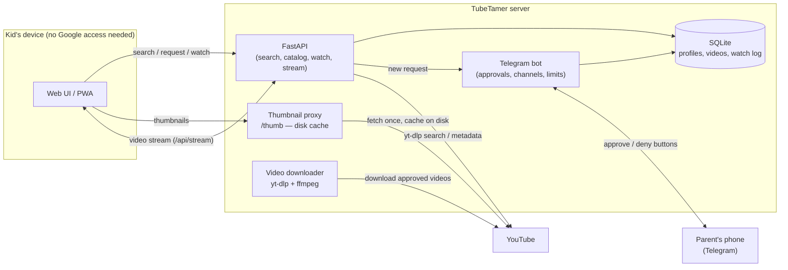
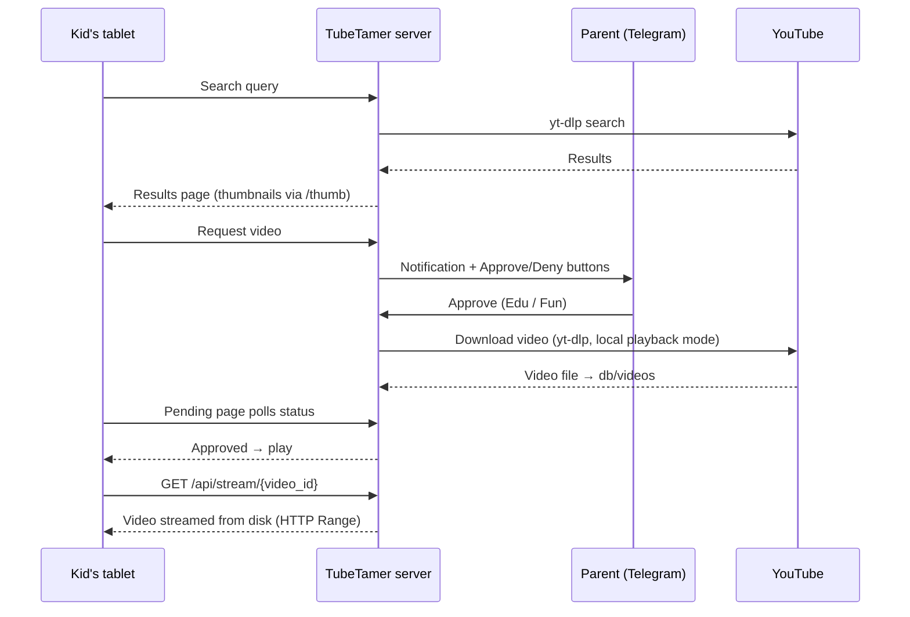

# Architecture

The kid's device only ever talks to the TubeTamer server: pages, thumbnails (`/thumb`), and video streams (`/api/stream`) are all served locally. The server is the single component that contacts YouTube — which is what makes full DNS/IP blocking of Google possible on the kid's device.

## Request Flow

In embed mode (`local_playback.enabled: false`), the last two steps are replaced by a YouTube iframe embed on the watch page — the tablet then needs direct YouTube access.
