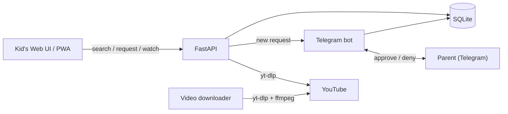

# Architecture and startup

TubeTamer runs as a single Python process. It hosts a FastAPI web app for the kid, a Telegram bot for the parent, an optional video downloader, and a few background tasks. They all share one SQLite database through `VideoStore`.

The kid's device only ever talks to the TubeTamer server. Pages, thumbnails (`/thumb`) and video streams (`/api/stream`) are all served locally, so YouTube/Google can be blocked completely on the kid's device. See [docs/architecture.md](../docs/architecture.md) for the full diagrams.

## Startup (`main.py`)

`main()` parses CLI flags (`-c/--config`, `-v/--verbose`, `--log-level`), loads the config with `load_config`, builds a `TubeTamer` orchestrator and runs it on the asyncio loop. SIGINT/SIGTERM handlers call `app.stop()`.

`TubeTamer.setup()` runs these steps in order:

1. Creates the database directory and opens `VideoStore(db_path=...)`.
2. `_bootstrap_profiles()`: on first run, creates a `default` profile from the config PIN, with a random avatar icon and color.
3. If a Telegram bot token and admin chat ID are set, creates `TubeTamerBot` (it also gets the path to `starter-channels.yaml`).
4. Fills `fastapi_app.state` with shared objects: the video store, the web, watch-limit and YouTube configs, the locale and time format, a `YouTubeExtractor`, and callbacks (see below).
5. If `local_playback.enabled` is true, creates a `VideoDownloader` (video dir, quality, max storage, concurrency, retention, subtitle languages) and connects it to the bot's approve/revoke events.
6. Adds the middleware: `SecurityHeadersMiddleware`, `PinAuthMiddleware` (with the config PIN) and Starlette `SessionMiddleware`. The session secret is created once and saved in the DB settings table. Sessions last 86400 s with `same_site="strict"`.

`TubeTamer.run()` starts the bot, starts the downloader workers (retrying downloads that failed before), prunes old `watch_log`/`search_log` rows, starts `_backfill_loop`, and serves FastAPI through `uvicorn.Server`.

`_backfill_loop` runs `_backfill_identifiers()` every hour (`_INTERVAL = 3600`). For each profile it fills in missing data: channel IDs for channels, `@handle`s for channels, and channel IDs for videos. It uses `resolve_channel_handle`, `resolve_handle_from_channel_id` and `extract_metadata`.

`stop()` cancels the backfill task, then stops the downloader, the bot and the video store.

## Shared state and dependency injection

The web layer never imports `main.py`. Everything goes through `app.state`, and FastAPI dependency providers in `web/deps.py` read it:

| Provider | Returns |
|---|---|
| `get_video_store` | the global `VideoStore` |
| `get_child_store` | a `ChildStore` for `request.session["child_id"]` (default `"default"`) |
| `get_web_config` / `get_wl_config` / `get_youtube_config` | config sections |
| `get_extractor` | the `YouTubeExtractor` |
| `get_notify_cb` | async callback that notifies the parent about a new video request |
| `get_time_limit_cb` | async callback for "time limit reached" notifications |

Callbacks set in `setup()` connect the web app and the bot:

- `notify_callback(video, profile_id)` → `bot.notify_new_request`
- `time_limit_cb(...)` → `bot.notify_time_limit_reached`
- `bot.on_channel_change` → invalidates the channel cache for the profile
- `download_on_approve` / `delete_on_revoke` → downloader enqueue / delete (only in local playback mode)

## FastAPI app (`web/app.py`)

`web/app.py` creates the `FastAPI` instance with a `lifespan` context manager. On startup it launches `channel_cache_loop(app.state)` as a background task. The module also mounts `/static`, registers the Jinja2 filters, and includes the routers: auth, profile, ytproxy, catalog, pages, pwa, search, watch, stream.

`RateLimitExceeded` (slowapi) is turned into an HTTP 429 with `Retry-After: 5`. Paths under `/api/` get a JSON body, other paths get a short localized HTML page.

`web/shared.py` is a neutral module (it imports nothing from `web.*`). It holds:

- the `Jinja2Templates` instance and its globals: `t`, `cat_label`, `day_label`, `fmt_time`, `html_lang`, `app_name`, `format_duration`, `app_version`
- the slowapi `limiter`. Its key function uses the first `X-Forwarded-For` IP, then `X-Real-IP`, then the socket address.

## Request / approval flow

1. The kid searches. The server runs a yt-dlp search and shows results, with thumbnails served through `/thumb`.
2. The kid requests a video. The web app stores it as pending and calls `notify_callback`. The parent gets a Telegram message with Approve/Deny buttons.
3. The parent approves it as Edu or Fun. In local playback mode the downloader fetches the file into the video directory.
4. The pending page polls the status. Once the video is approved (and downloaded), the watch page plays it from `/api/stream/{video_id}` with HTTP Range support. In embed mode (`local_playback.enabled: false`) a YouTube iframe is used instead, so the tablet needs direct YouTube access.

## Time utilities (`utils.py`)

These helpers handle timezones and schedules for watch limits: `get_weekday`, `get_today_str`, `get_day_utc_bounds`, `parse_time_input`, `format_time_12h`, `is_within_schedule`, `get_bonus_minutes` and `resolve_setting`. `resolve_setting` looks for a per-day override of a setting before falling back to the base key.

Related: [Web app](web-app.md) · [Telegram bot](telegram-bot.md) · [Data layer](data-layer.md) · [Quickstart](quickstart.md)
